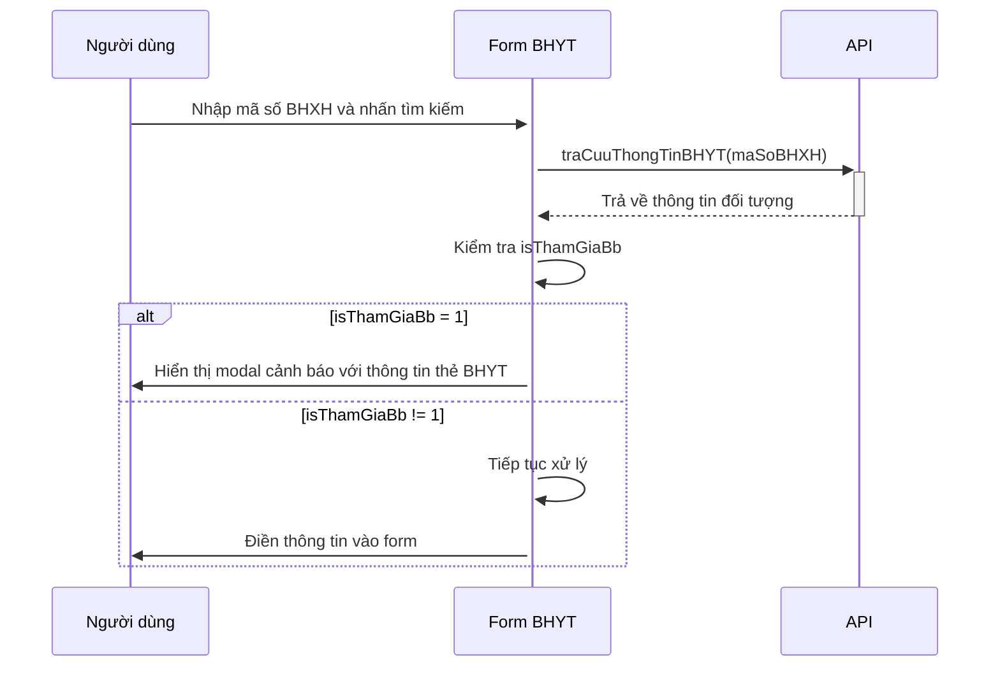
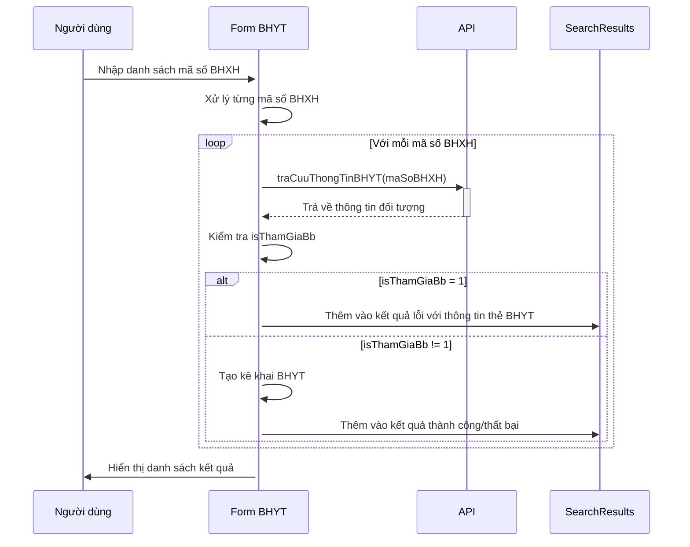

# Tài liệu luồng xử lý kiểm tra BHXH bắt buộc

## Tổng quan
Tài liệu này mô tả cách hệ thống xử lý và hiển thị thông báo khi phát hiện đối tượng đang tham gia BHXH bắt buộc (có `isThamGiaBb = 1`), giúp người dùng biết rằng đối tượng đã có thẻ BHYT và không cần kê khai BHYT tự nguyện.

## Cấu trúc mã

Tính năng này được triển khai trong 3 phương thức chính của component `KeKhaiBHYTComponent`:

1. `onSearchBHYT()` - Xử lý khi tìm kiếm một mã số BHXH
2. `handleSearchMultipleOk()` - Xử lý khi tìm kiếm nhiều mã số BHXH cùng lúc
3. `createKeKhaiFromApiData()` - Xử lý khi tạo kê khai từ dữ liệu API

## Luồng xử lý

### 1. Tìm kiếm đơn lẻ



**Mã nguồn**:
```typescript
onSearchBHYT(): void {
  // ... (code khác)
  this.keKhaiBHYTService.traCuuThongTinBHYT(maSoBHXH).subscribe({
    next: async (response) => {
      if (response.success) {
        const data = response.data;
        
        // Kiểm tra nếu isThamGiaBb = 1 thì hiển thị thông báo
        if (data.isThamGiaBb === 1) {
          this.modal.warning({
            nzTitle: 'Thông báo BHXH bắt buộc',
            nzContent: `<div>
              <p>Đối tượng đang tham gia BHXH bắt buộc.</p>
              <p><strong>Số thẻ BHYT:</strong> ${data.soTheBHYT || 'Chưa có'}</p>
            </div>`,
            nzOkText: 'Đã hiểu'
          });
          this.loadingSearch = false;
          return;
        }
        
        // Tiếp tục xử lý nếu không tham gia BHXH bắt buộc
        // ...
      }
    }
  });
}
```

### 2. Tìm kiếm nhiều mã số



**Mã nguồn**:
```typescript
async handleSearchMultipleOk(): Promise<void> {
  // ... (code chuẩn bị)
  
  // Xử lý từng mã số BHXH
  for (let i = 0; i < maSoBHXHList.length; i++) {
    const maSoBHXH = maSoBHXHList[i];
    try {
      const response = await this.keKhaiBHYTService.traCuuThongTinBHYT(maSoBHXH).toPromise();
      if (response && response.success) {
        // Kiểm tra isThamGiaBb
        if (response.data.isThamGiaBb === 1) {
          failedCount++;
          
          const theBhyt = response.data.soTheBHYT ? 
            `Số thẻ BHYT: ${response.data.soTheBHYT}` : 
            'Chưa có thông tin số thẻ BHYT';
            
          this.searchResults.push({
            maSoBHXH,
            status: 'error',
            message: `Đối tượng đang tham gia BHXH bắt buộc.\n${theBhyt}`
          });
          continue;
        }
        
        // Tiếp tục xử lý nếu không tham gia BHXH bắt buộc
        // ...
      }
    } catch (error) {
      // Xử lý lỗi
    }
  }
}
```

### 3. Tạo kê khai từ dữ liệu API

```mermaid
sequenceDiagram
    handleSearchMultipleOk->>+createKeKhaiFromApiData: Truyền dữ liệu từ API
    createKeKhaiFromApiData->>createKeKhaiFromApiData: Kiểm tra isThamGiaBb
    alt isThamGiaBb = 1
        createKeKhaiFromApiData-->>-handleSearchMultipleOk: Trả về lỗi với thông tin thẻ BHYT
    else isThamGiaBb != 1
        createKeKhaiFromApiData->>createKeKhaiFromApiData: Tiếp tục xử lý
        createKeKhaiFromApiData->>API: Tạo kê khai BHYT mới
        API-->>createKeKhaiFromApiData: Kết quả tạo kê khai
        createKeKhaiFromApiData-->>-handleSearchMultipleOk: Trả về kết quả
    end
```

**Mã nguồn**:
```typescript
private async createKeKhaiFromApiData(data: any): Promise<{ success: boolean; message?: string }> {
  try {
    // Kiểm tra xem đối tượng có đang tham gia BHXH bắt buộc không
    if (data.isThamGiaBb === 1) {
      const theBhyt = data.soTheBHYT ? 
        `Số thẻ BHYT: ${data.soTheBHYT}` : 
        'Chưa có thông tin số thẻ BHYT';
        
      return {
        success: false,
        message: `Đối tượng đang tham gia BHXH bắt buộc.\n${theBhyt}`
      };
    }
    
    // Tiếp tục xử lý tạo kê khai nếu không tham gia BHXH bắt buộc
    // ...
  } catch (error) {
    // Xử lý lỗi
  }
}
```

## Cấu trúc thông báo

### 1. Thông báo Modal (tìm kiếm đơn lẻ)
- **Tiêu đề**: `'Thông báo BHXH bắt buộc'`
- **Nội dung**: Sử dụng HTML định dạng
  ```html
  <div>
    <p>Đối tượng đang tham gia BHXH bắt buộc.</p>
    <p><strong>Số thẻ BHYT:</strong> ${data.soTheBHYT || 'Chưa có'}</p>
  </div>
  ```
- **Nút**: `'Đã hiểu'`

### 2. Thông báo trong danh sách kết quả (tìm kiếm nhiều)
- **Trạng thái**: `'error'`
- **Nội dung**: Sử dụng ký tự xuống dòng
  ```
  Đối tượng đang tham gia BHXH bắt buộc.
  Số thẻ BHYT: ${response.data.soTheBHYT}
  ```

## Cách hiển thị số thẻ BHYT

Hệ thống hiển thị số thẻ BHYT với các xử lý sau:
1. Nếu có `soTheBHYT`: Hiển thị `Số thẻ BHYT: {soTheBHYT}`
2. Nếu không có `soTheBHYT`: Hiển thị `Chưa có thông tin số thẻ BHYT` hoặc `Chưa có`

## Lưu ý về tính năng

1. **Mục đích**: Ngăn người dùng kê khai BHYT tự nguyện cho người đã tham gia BHXH bắt buộc, tránh trùng lặp.
2. **Xử lý đồng bộ**: Đảm bảo kiểm tra `isThamGiaBb` ở cả 3 điểm truy cập (tìm kiếm đơn lẻ, tìm kiếm nhiều, tạo kê khai).
3. **Hiển thị rõ ràng**: Thông báo được định dạng rõ ràng, dễ đọc, giúp người dùng xác định chính xác đối tượng đã tham gia BHXH bắt buộc. 